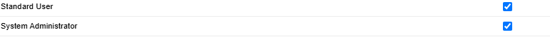

# INC-001 — Falha de visibilidade de campo

**Sistema:** Salesforce Sales Cloud  
**Ambiente:** Trailhead Playground  
**Tipo:** Incidente simulado  
**Prioridade:** Média (simulada)  
**Status:** Resolvido e validado

## 1. Descrição do incidente

O usuário fictício Lucas Oliveira, associado ao perfil
Standard User, não conseguia visualizar o campo
"Categoria de Atendimento" no objeto Account.

O incidente foi reproduzido no registro fictício
TechNova Solutions.

## 2. Ambiente e contexto

- Objeto: Account
- Campo: Categoria de Atendimento
- Perfil: Standard User
- Usuário: Lucas Oliveira
- Recurso: Field-Level Security (FLS)

## 3. Investigação

Foi realizada a verificação das configurações de
segurança em nível de campo.

Caminho utilizado:

Setup > Object Manager > Account >
Fields & Relationships >
Categoria de Atendimento >
Set Field-Level Security

Foi identificado que a opção "Visible" estava
desmarcada para o perfil Standard User.

O teste com o usuário Lucas confirmou que o campo
não aparecia no formulário de edição da conta.

## 4. Correção aplicada

Na configuração Field-Level Security, a opção
"Visible" foi habilitada para Standard User.

A alteração foi salva pelo administrador.

## 5. Validação

Após a correção, foi realizado um novo teste
utilizando o usuário Lucas Oliveira.

Resultado:

- Antes: campo não aparecia.
- Depois: campo passou a aparecer.
- Status do teste: aprovado.

## 6. Causa identificada

A restrição de visibilidade configurada no perfil
Standard User foi a causa do comportamento
reproduzido no laboratório.

A investigação não incluiu auditoria completa
de Permission Sets e demais políticas de acesso.

## 7. Boas práticas

Em ambientes corporativos, mudanças de permissão
devem ser autorizadas e avaliadas segundo o
princípio do menor privilégio.

Como mudanças no perfil afetam vários usuários,
um Permission Set específico pode ser uma
alternativa mais adequada.

## 8. Conclusão

O exercício demonstrou um fluxo básico de suporte:

1. Reprodução do problema.
2. Investigação da configuração.

   
## 9. Evidências

### Configuração após a correção

A captura abaixo demonstra que a visibilidade
do campo foi habilitada para os perfis
Standard User e System Administrator.

**Resultado:** configuração corrigida e
visibilidade validada com o usuário de teste.

4. Identificação da restrição.
5. Aplicação da correção.
6. Validação do resultado.

**Natureza:** exercício educacional realizado
em ambiente de treinamento, sem dados reais.
