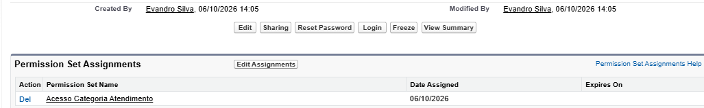

# INC-002 — Gestão de acesso com Permission Set

**Sistema:** Salesforce Sales Cloud  
**Ambiente:** Trailhead Playground  
**Tipo:** Simulação de solicitação de acesso  
**Status:** Resolvido e validado

## 1. Cenário

O usuário fictício Lucas Oliveira precisava acessar
o campo "Categoria de Atendimento", no objeto Account,
sem que a permissão fosse concedida a todos os
usuários do perfil Standard User.

## 2. Objetivo

Aplicar o princípio do menor privilégio por meio
de um Permission Set específico.

## 3. Configuração

Foi criado o Permission Set:

**Acesso Categoria Atendimento**

Configurações aplicadas:

- Objeto: Account
- Campo: Categoria de Atendimento
- Read Access: habilitado
- Edit Access: habilitado
- Usuário atribuído: Lucas Oliveira

## 4. Procedimento

1. Criação do Permission Set.
2. Configuração das permissões do campo.
3. Atribuição ao usuário Lucas Oliveira.
4. Remoção da visibilidade no perfil Standard User.
5. Teste de acesso com o usuário.

## 5. Validação

Após remover a permissão do perfil Standard User,
o usuário Lucas Oliveira continuou visualizando
o campo Categoria de Atendimento.

**Resultado:** teste aprovado.

## 6. Conclusão

O laboratório demonstrou como conceder acesso
específico utilizando Permission Sets, sem
ampliar as permissões de todo um perfil.

Em um ambiente corporativo, a concessão de acesso
deve seguir aprovação e políticas de segurança.
As permissões de leitura e edição devem ser
avaliadas separadamente conforme a necessidade.

## 7. Evidências

A captura mostra o Permission Set atribuído
ao usuário de teste.

**Natureza:** exercício educacional com dados
fictícios em ambiente de treinamento.
