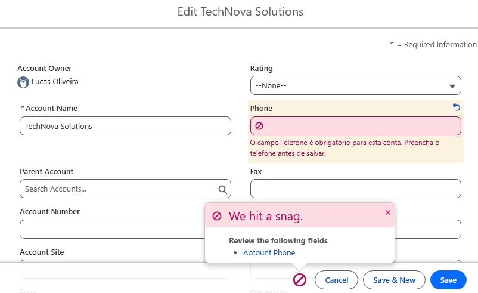

# INC-003 — Erro ao salvar registro no Salesforce

**Sistema:** Salesforce Sales Cloud  
**Ambiente:** Trailhead Playground  
**Tipo:** Incidente simulado  
**Prioridade:** Média (simulada)  
**Status:** Resolvido e validado

## 1. Descrição do incidente

O usuário fictício Lucas Oliveira relatou
dificuldades ao atualizar o cadastro da empresa
TechNova Solutions no objeto Account.

Ao tentar salvar o registro sem preencher o
campo Phone, o Salesforce apresentava uma
mensagem de erro e bloqueava a operação.

## 2. Ambiente

- Objeto: Account
- Registro: TechNova Solutions
- Usuário: Lucas Oliveira
- Recurso: Validation Rules

## 3. Investigação

Foi analisada a regra de validação:

`Exigir_Telefone_TechNova`

A regra utiliza a seguinte fórmula:

```salesforce
AND(
    Name = "TechNova Solutions",
    ISBLANK(Phone)
)
```

A fórmula retorna verdadeiro quando a conta
TechNova Solutions está sem telefone.

Nesse cenário, o Salesforce impede o salvamento.

## 4. Reprodução do problema

1. Acesso ao Salesforce como Lucas Oliveira.
2. Abertura do registro TechNova Solutions.
3. Remoção do valor do campo Phone.
4. Tentativa de salvar o registro.
5. Confirmação da mensagem de erro.

**Resultado:** erro reproduzido.

## 5. Solução aplicada

Após identificar que a regra representava
um requisito válido, foi realizada a correção
dos dados do registro.

O campo Phone foi preenchido com um número
fictício de teste.

A regra de validação permaneceu ativa.

## 6. Validação

Após a correção:

- O registro foi salvo com sucesso.
- O telefone permaneceu preenchido.
- Uma nova tentativa de salvar foi realizada.
- Nenhum erro de validação foi apresentado.

**Resultado:** teste aprovado.

## 7. Evidências

### Erro reproduzido



### Correção validada


## 8. Conclusão

O exercício demonstrou a importância de
investigar a origem de erros antes de
modificar regras de negócio.

A solução foi corrigir os dados do registro,
preservando a validação existente.

**Natureza:** exercício educacional realizado
em ambiente Salesforce de treinamento.
