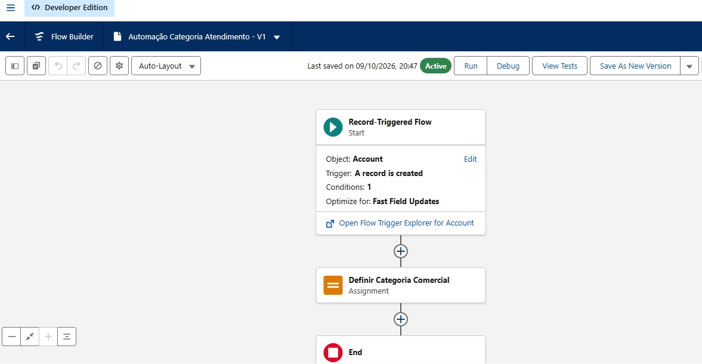
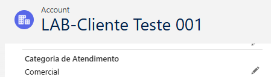

# INC-004 — Automação de Categoria de Atendimento

**Sistema:** Salesforce Sales Cloud  
**Ambiente:** Trailhead Playground  
**Tipo:** Solicitação de melhoria (simulada)  
**Recurso:** Record-Triggered Flow  
**Status:** Implementado e validado

## 1. Descrição da solicitação

A equipe comercial identificou a necessidade de
padronizar o preenchimento do campo Categoria de
Atendimento durante o cadastro de novos clientes.

O preenchimento manual poderia ocasionar
registros sem classificação.

Foi proposta uma automação para atribuir
automaticamente a categoria Comercial a contas
de teste que atendam aos critérios definidos.

## 2. Objetivo

Implementar uma automação declarativa capaz de:

- Identificar novas contas com prefixo LAB-.
- Verificar se a categoria está vazia.
- Preencher automaticamente a categoria Comercial.
- Evitar atualizações desnecessárias de registros.

## 3. Configuração técnica

**Nome:** Automação Categoria Atendimento

**Tipo:** Record-Triggered Flow

**Objeto:** Account

**Gatilho:** A record is created

**Condições:** Formula Evaluates to True

**Otimização:** Fast Field Updates

### Fórmula de entrada

```text
AND(
    BEGINS({!$Record.Name}, "LAB-"),
    ISBLANK(TEXT({!$Record.Categoria_de_Atendimento__c}))
)
```

A fórmula restringe a execução a contas
de laboratório cujo nome começa com LAB-
e cuja categoria está vazia.

## 4. Assignment

**Elemento:** Definir Categoria Comercial

Configuração:

- Variable: $Record.Categoria_de_Atendimento__c
- Operator: Equals
- Value: Categoria_Comercial
- Tipo da constante: Text
- Valor da constante: Comercial

O Assignment modifica o valor do campo no
registro que acionou o Flow.

## 5. Implementação

1. Criação do Record-Triggered Flow.
2. Configuração do objeto Account.
3. Definição da fórmula de entrada.
4. Seleção de Fast Field Updates.
5. Criação da constante Categoria_Comercial.
6. Configuração do elemento Assignment.
7. Salvamento e ativação da automação.

## 6. Teste funcional

Foi criada uma conta fictícia:

**Account Name:** LAB-Cliente Teste 001

**Categoria de Atendimento:** deixada vazia
durante a criação.

### Resultado observado

Após o salvamento, o Salesforce apresentou
automaticamente:

**Categoria de Atendimento: Comercial**

O Flow permaneceu ativo e não apresentou
erros ou avisos no painel de configuração.

**Resultado:** teste funcional aprovado.

## 7. Evidências

### Automação ativa



### Resultado da automação



## 8. Conclusão

O laboratório demonstrou a implementação
de uma automação declarativa utilizando
Salesforce Flow Builder.

Foram praticados conceitos de:

- Record-Triggered Flows.
- Fórmulas condicionais.
- Manipulação de campos com Assignment.
- Fast Field Updates.
- Testes funcionais e validação de resultados.

A automação foi limitada a contas fictícias
do laboratório, reduzindo o risco de afetar
outros registros.

**Natureza:** projeto educacional desenvolvido
em ambiente Salesforce Trailhead Playground.
